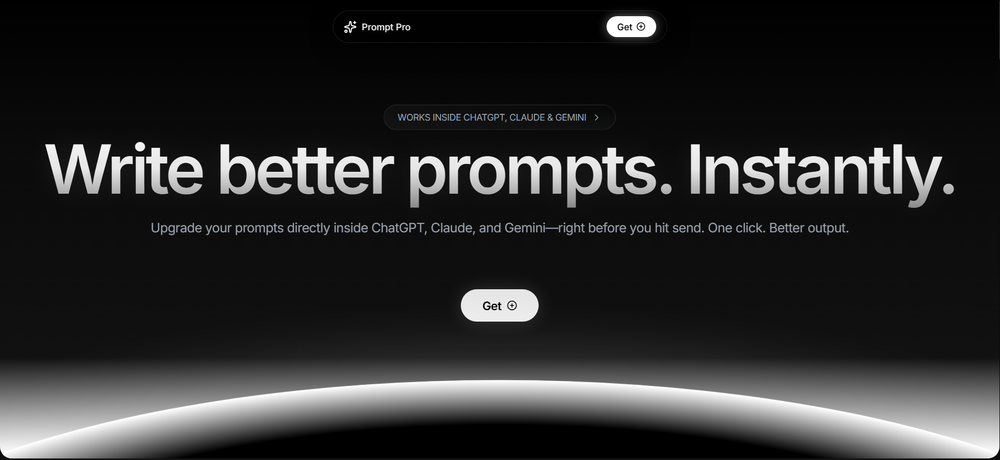
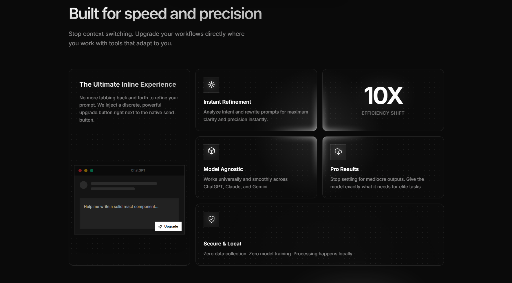
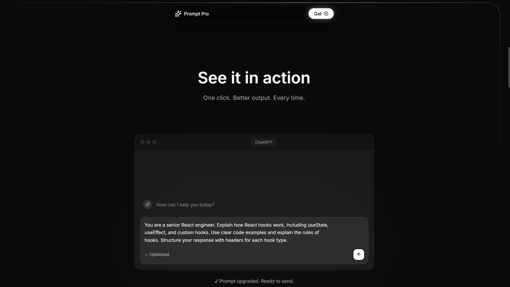
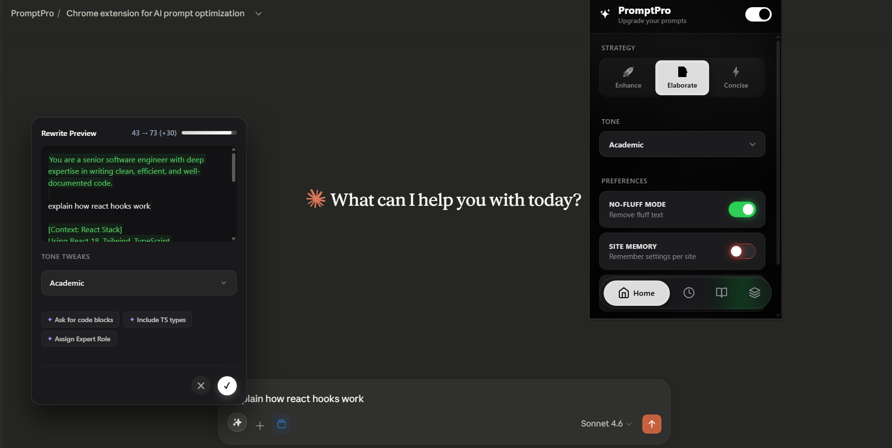
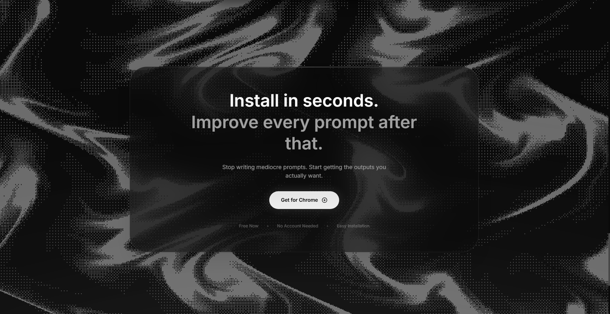

# PromptPro ✦ Upgrade your prompts. Everywhere.
The first native prompt optimization layer that lives inside AI tools—right where you type.

[**Visit Landing Page →**](https://promptpro-beta.vercel.app/) | [**Get for Chrome →**](https://promptpro-beta.vercel.app/#install)

---

### **No context switching. No data leakage. Just better prompts.**

PromptPro is a lightweight, local-first Chrome Extension that upgrades your prompts in real-time, directly inside the input boxes of **ChatGPT**, **Claude**, and **Gemini**. Say goodbye to copying and pasting from external prompt optimizers.

## 💎 Features at a Glance

  

*   **Inline UX Integration**: Injects a sleek "✨ Upgrade" button directly beside the native send button in your favorite AI chat platforms.
*   **Apple-Inspired Aesthetics**: Experience state-of-the-art glassmorphic UI, fluid momentum animations, sweep glows, and a beautiful monotone mesh-gradient popup.
*   **Intelligent Strategies**: Leverage contextually smart strategies like **Enhance** 🚀, **Elaborate** 📝, and **Concise** ⚡ to structure prompts mathematically, optimizing for the best AI inference results.
*   **Tone Crafting**: From Professional to Academic, use the liquid-glass tone selector to refine the exact "flavor" of the AI's response.
*   **Local-First Architecture**: Your prompts never leave your machine. Configuration, history, and library templates live exclusively on your device via `chrome.storage.local`.

---

## 📐 See it in action 

  

PromptPro uses a monolithic, zero-friction DOM interception strategy to anchor securely onto React/Angular frameworks without corrupting them. The injected UI feels like a native part of the web app, but operates strictly inside the isolated extension boundary.

---

## 🎨 Premium Configuration Popup

  

### Total Control. Instantly Accessible.
Click the PromptPro extension icon in your toolbar to unlock advanced prompt settings seamlessly across web applications:
*   **Default Strategy:** Seamlessly toggle your baseline logic model.
*   **No-Fluff Mode:** A strict parser that strips unnecessary preamble (Available under *Preferences*).
*   **Prompt Library:** Save your heavily-crafted formulas locally.
*   **Context Blocks:** Inject dynamic, static contexts into specific queries efficiently without needing deep prompt re-writes.

---

## 🛠 Installation

  

**Prerequisites:** Google Chrome, Brave, Arc, or Microsoft Edge.

### Option 1: Direct Link (Recommended)
Visit the [**PromptPro Install Page**](https://promptpro-beta.vercel.app/#install) to get the latest version for Chrome.

### Option 2: Developer Mode (Local Setup)
1. **Clone or Download:** Pull this repository to your local machine.
2. **Open Extensions Page:** Open your browser and navigate to `chrome://extensions/`.
3. **Toggle Developer Mode:** Turn on the "Developer mode" switch in the top right.
4. **Load Unpacked:** Click "Load unpacked" and select the root directory containing `manifest.json`.
5. **Pin PromptPro:** 📌 Pin the sparkle icon to your toolbar for immediate access to your history and preferences!

---

## 🕹 How to Use

1.   Navigate to [ChatGPT](https://chatgpt.com), [Claude](https://claude.ai), or [Gemini](https://gemini.google.com).
2.   Type a crude, simple prompt directly into the standard input box (e.g., *"write me a python loop"*).
3.   Instead of hitting Enter, click the glowing **✨ Upgrade** button right next to the Send button.
4.   A sleek glassmorphic popover instantly displays the optimized, multidimensional rewritten prompt.
5.   Hit **Apply (✓)**. Your input text is instantly substituted in the DOM.
6.   Send it to the AI for a vastly superior answer!

---

 

  
  
Built with 🤍 for maximum productivity.

  
<a href="https://promptpro-beta.vercel.app/">promptpro-beta.vercel.app</a>

